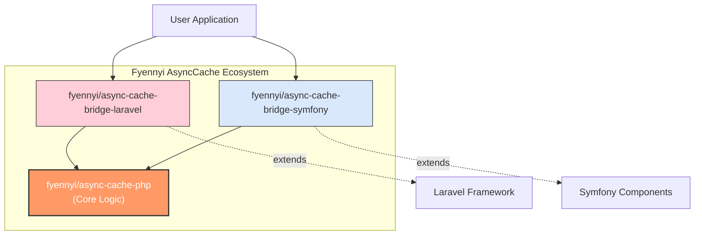

# Framework Integration

The `fyennyi/async-cache-php` library provides dedicated bridges for popular PHP frameworks like Laravel and Symfony, simplifying integration and leveraging their existing caching, logging, and dependency injection mechanisms.

These bridges abstract away much of the manual setup, allowing you to focus on utilizing asynchronous caching in your application's business logic.

## AsyncCache Ecosystem Overview

The following diagram illustrates how the core `async-cache-php` library integrates with various user applications and frameworks through its dedicated bridges:



## Integration Details

=== "Laravel"

    The `fyennyi/async-cache-bridge-laravel` package offers seamless integration for Laravel applications:

    - **Automatic Discovery**: Registers the service provider automatically via Laravel Package Discovery.
    - **Seamless Integration**: Automatically wires the `AsyncCacheManager` with Laravel's default cache repository (`cache.store`) and log manager.
    - **Configuration Friendly**: Allows defining global strategies and adapters through a standard Laravel configuration file (`config/async-cache.php`).

    ### Installation & Configuration

    For detailed installation and configuration instructions, please refer to the dedicated `README.md` of the [Laravel Bridge package](https://github.com/Fyennyi/async-cache-bridge-laravel/blob/main/README.md).

    ### Usage Example

    Once installed and configured, you can inject the `AsyncCacheManager` into your Laravel components:

    ```php
    namespace App\Http\Controllers;

    use Fyennyi\AsyncCache\AsyncCacheManager;
    use Fyennyi\AsyncCache\CacheOptions;
    use Illuminate\Http\Request;

    class WeatherController extends Controller
    {
        public function __construct(
            private AsyncCacheManager $cache
        ) {}

        public function index(string $city)
        {
            $promise = $this->cache->wrap(
                'weather_' . $city,
                fn() => $this->fetchFromApi($city),
                new CacheOptions(ttl: 300)
            );

            // Example for sync retrieval in a traditional FPM environment:
            return \React\Async\await($promise);
        }

        private function fetchFromApi(string $city) { /* ... */ }
    }
    ```

=== "Symfony"

    The `fyennyi/async-cache-bridge-symfony` package provides robust integration for Symfony applications:

    - **Automatic Service Registration**: Registers `AsyncCacheManager` as a service in the Symfony container.
    - **Seamless Integration**: Automatically wires with Symfony's default cache pool (`cache.app`), lock component (`lock.factory`), logger, and event dispatcher.
    - **Configuration Friendly**: Allows defining global strategies via YAML configuration files (`config/packages/async_cache.yaml`).

    ### Installation & Configuration

    For detailed installation and configuration instructions, please refer to the dedicated `README.md` of the [Symfony Bridge package](https://github.com/Fyennyi/async-cache-bridge-symfony/blob/main/README.md).

    ### Usage Example

    You can inject the `AsyncCacheManager` into your Symfony services or controllers:

    ```php
    namespace App\Service;

    use Fyennyi\AsyncCache\AsyncCacheManager;
    use Fyennyi\AsyncCache\CacheOptions;

    class WeatherService
    {
        public function __construct(
            private AsyncCacheManager $cache
        ) {}

        public function getForecast(string $city): \React\Promise\PromiseInterface
        {
            return $this->cache->wrap(
                'weather_' . $city,
                fn() => $this->fetchFromApi($city),
                new CacheOptions(ttl: 300)
            );
        }

        private function fetchFromApi(string $city) { /* ... */ }
    }
    ```
